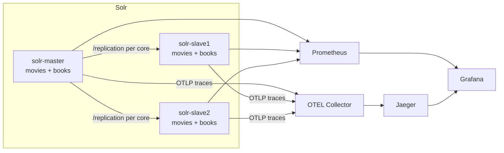

# Solr 10 User-Managed Reference Lab

This repository is a local learning environment for Apache Solr 10 in user-managed mode.

It runs:

- 1 Solr master write node
- 2 Solr follower read nodes
- 2 user-managed cores: `movies` and `books`
- classic `ReplicationHandler` replication from the master to both followers
- OpenTelemetry tracing
- Jaeger for trace search and visualization
- Prometheus for metrics scraping
- Grafana for dashboards

There is no SolrCloud, no ZooKeeper, and no collections.

## Architecture diagram



## Prerequisites

- Docker
- Docker Compose
- `curl`

## Quick start

```bash
cp .env.example .env
make up
make seed
make smoke-test
```

Useful URLs:

- Solr master: `http://localhost:8983/solr`
- Solr slave 1: `http://localhost:8984/solr`
- Solr slave 2: `http://localhost:8985/solr`
- Prometheus: `http://localhost:9090`
- Grafana: `http://localhost:3000`
- Jaeger: `http://localhost:16686`

Grafana defaults to `admin / admin` unless you override `.env`.

## Repository structure

- `docker/solr/` contains the custom Solr image build and the init script that precreates cores.
- `solr/` contains the repo-owned Solr configs that get copied into the image at build time.
- `observability/` contains OTEL Collector, Prometheus, and Grafana configuration.
- `data/seed/` contains the sample `movies` and `books` JSON documents.
- `scripts/` contains the helper commands used by `make`.

## How replication works

- `solr-master` is the only node that receives writes in this lab.
- Each core on the master exposes `/replication` as a leader.
- Each core on each follower exposes `/replication` as a follower and polls the master every 5 seconds.
- A hard commit on the master makes the new index version available to followers.
- The helper script `scripts/replication/check-index-versions.sh` compares `indexversion` across all three nodes.

Replication is asynchronous. Followers are intended to be query nodes, but this lab does not hard-block writes to them.

## How observability works

- Solr loads the `opentelemetry` module from the official `solr:10.0.0` image.
- `solr.xml` enables `OtelTracerConfigurator`.
- Each Solr node exports OTLP traces to the OTEL Collector.
- The OTEL Collector forwards traces to Jaeger.
- Prometheus scrapes each Solr node directly from `/solr/admin/metrics?wt=openmetrics`.
- Grafana is provisioned with both Prometheus and Jaeger datasources and loads dashboards from the repo.

## Common commands

```bash
make help
make up
make down
make restart
make logs
make seed
make smoke-test
make recreate-cores
make clean
```

## Sample queries

Query the seeded movie documents on the master:

```bash
curl "http://localhost:8983/solr/movies/select?q=arrival&wt=json&indent=true"
```

Query the same movie documents from follower 1:

```bash
curl "http://localhost:8984/solr/movies/select?q=genre:science&wt=json&indent=true"
```

Query the seeded book documents on follower 2:

```bash
curl "http://localhost:8985/solr/books/select?q=author:tolkien&wt=json&indent=true"
```

Check per-core replication status manually:

```bash
curl "http://localhost:8983/solr/movies/replication?command=details&wt=json"
curl "http://localhost:8984/solr/movies/replication?command=details&wt=json"
```

## Troubleshooting

- If `make up` fails, inspect `docker compose logs -f`.
- If the Solr nodes are up but a core is missing, run `scripts/solr/check-cores.sh`.
- If replication lags, run `scripts/replication/check-index-versions.sh` and inspect the follower `/replication?command=details` output.
- If traces do not appear in Jaeger, check `docker compose logs -f otel-collector` and verify the Solr requests are actually hitting the nodes.
- If you change Solr core configs and want a completely clean restart, run `make recreate-cores`.
- If you want to wipe everything, including Grafana and Prometheus state, run `make clean`.

## Core schemas

`movies` fields:

- `id`
- `title`
- `synopsis`
- `genre`
- `release_year`
- `director`
- `cast`
- `language`
- `runtime_minutes`
- `rating`

`books` fields:

- `id`
- `title`
- `summary`
- `author`
- `genre`
- `isbn`
- `publication_year`
- `language`
- `page_count`
- `rating`

## Solr 10 notes

- This lab uses the official `solr:10.0.0` image as the base for the custom image.
- The base image already contains the `opentelemetry` module.
- Core data lives under `/var/solr/data`.
- The custom init script precreates `movies` and `books` on first boot and then keeps the core `conf/` directories in sync with the image.

## Next learning steps

- Add authentication and TLS.
- Add another follower and compare replication lag.
- Compare this user-managed setup with a small SolrCloud deployment.
- Add more fields, copyField rules, or language-specific analyzers.
- Add an application service that writes to the master and reads from the followers.
